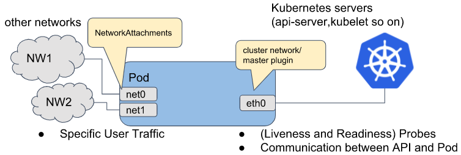

# Multus CNI

> Pod에 다수의 네트워크 인터페이스 연결을 위한 Multus CNI 사용과 관련된 Reference

Multus CNI : Kubernetes의 Pod에 **Multiple Network Interface** 를 붙이는 것이 가능하도록 하는 CNI

Ref) [CNI 개념](../README.md)

Pod에 다수의 Network Interface를 연결 및 **하드웨어 가속 기능(DPDK, SR-IOV)** 적용 가능

# 배경

Kubernetes의 Pod는 기본적으로 오직 하나의 Network Interface를 가짐 (Loopback 제외)

Kubernetes 활용 범위가 넓어짐으로 인해 Pod에 **복수 개의 NIC** 을 제공하는 환경이 요구되는 경우 증가

- 다수의 NIC 제공을 통한 장점
    - 트래픽 경로 분리 → 보안성 강화
    - 특정 NIC에 하드웨어 가속(SR-IOV)을 설정함으로써 성능 최적화

# Multus CNI 개념

## Multus CNI 특징

- **CNI Meta Plugin** : 다수의 다른 CNI Plugin을 호출할 수 있는 Meta-Plugin 역할을 수행 (직접 Network Interface를 구성하진 않음)
- Kubernetes **Network CRD 표준** 을 따름 → **Network Attachment Definition**
    - 추가적인 Network Interface를 위한 환경을 지정하는 표준화된 방법
- **Bare Metal Container Experience Kit** 프로젝트 중에 하나

## Multi-Homed Pod

Multus CNI에 의해 구성된 Pod의 Network Interface



### Pod의 Network Interface

- **eth0** : Kubernetes Server/Service(Kubernetes API-Server, Kubelet…)와 연결하기 위한 Kubernetes Cluster Network를 연결
- **net0** & **net1** : [다른 CNI Plugin (VLAN, VXLAN, PTP...)](https://kubernetes.io/docs/concepts/extend-kubernetes/compute-storage-net/network-plugins/) 기반의 Network에 연결하기 위한 추가적인 Network

---

# Prerequisites

> Multus CNI 사용하기 위한 사전 환경 구성

## 설치 전 Check List

- CNI Binary file check
    
    ```bash
    # Root 권한으로 수행
    sudo su
    # /opt/cni/bin : CNI Binary Path
    ls -ltrh /opt/cni/bin
    
    합계 260M
    -rwxr-xr-x. 1 root root 2.7M  9월 14 23:11 host-device
    -rwxr-xr-x. 1 root root 3.1M  9월 14 23:11 firewall
    -rwxr-xr-x. 1 root root 7.1M  9월 14 23:11 dhcp
    -rwxr-xr-x. 1 root root 2.5M  9월 14 23:11 vrf
    -rwxr-xr-x. 1 root root 2.8M  9월 14 23:11 vlan
    -rwxr-xr-x. 1 root root 2.0M  9월 14 23:11 static
    -rwxr-xr-x. 1 root root 2.5M  9월 14 23:11 sbr
    -rwxr-xr-x. 1 root root 2.9M  9월 14 23:11 ptp
    -rwxr-xr-x. 1 root root 2.8M  9월 14 23:11 macvlan
    -rwxr-xr-x. 1 root root 2.8M  9월 14 23:11 ipvlan
    -rwxr-xr-x. 1 root root 3.0M  9월 14 23:11 bridge
    -rwxr-xr-x. 1 root root 3.7M  1월  4 02:58 bandwidth
    -rwsr-xr-x. 1 root root  56M  1월  4 02:58 calico
    -rwsr-xr-x. 1 root root  56M  1월  4 02:58 calico-ipam
    -rwxr-xr-x. 1 root root 2.4M  1월  4 02:58 flannel
    -rwxr-xr-x. 1 root root 3.1M  1월  4 02:58 host-local
    -rwsr-xr-x. 1 root root  56M  1월  4 02:58 install
    -rwxr-xr-x. 1 root root 3.2M  1월  4 02:58 loopback
    -rwxr-xr-x. 1 root root 3.6M  1월  4 02:58 portmap
    -rwxr-xr-x. 1 root root 3.3M  1월  4 02:58 tuning
    -rwxr-xr-x. 1 root root  41M  1월  9 01:08 multus
    ```
    
- CNI Information check
    
    ```bash
    # CNI Config Path
    ls -ltrh /etc/cni/net.d/
    
    합계 12K
    drwxr-xr-x. 2 root root   31  1월  9 01:08 multus.d
    -rw-------. 1 root root  705  1월  9 01:08 00-multus.conf
    -rw-r--r--. 1 root root  658  1월  9 02:20 10-calico.conflist
    -rw-------. 1 root root 2.7K  1월  9 02:20 calico-kubeconfig
    
    # Calico Configuration Check
    cat 10-calico.conflist
    ```
    
- 10-calico.conflist
    
    ```json
    {
      "name": "k8s-pod-network",
      "cniVersion": "0.3.1",
      "plugins": [
        {
          "type": "calico",
          "log_level": "info",
          "log_file_path": "/var/log/calico/cni/cni.log",
          "datastore_type": "kubernetes",
          "nodename": "master1",
          "mtu": 0,
          "ipam": {
              "type": "calico-ipam"
          },
          "policy": {
              "type": "k8s"
          },
          "kubernetes": {
              "kubeconfig": "/etc/cni/net.d/calico-kubeconfig"
          }
        },
        {
          "type": "portmap",
          "snat": true,
          "capabilities": {"portMappings": true}
        },
        {
          "type": "bandwidth",
          "capabilities": {"bandwidth": true}
        }
      ]
    }
    ```
    

---

# Installation

- Git Clone & Apply Daemonset YAML

```yaml
# Multus Git Clone
git clone https://github.com/k8snetworkplumbingwg/multus-cni.git

cd multus-cni/deployments
# apply daemonset (Thick version)
kubectl apply -f multus-daemonset-thick.yaml
```

- Installation Check(Multus Daemonset)
    - **/opt/cni/bin** Directory에 위치한 Multus Binary를 기반으로 하는 Pod 실행
    - **/etc/cni/net.d** 에서 **00-multus.conf** 를 토대로 Multus에 대한 Configuration 파일을 생성
    - **/etc/cni/net.d/multus.d** 안에 Multus가 Kubernetes API에 접근하기 위한 인증 정보를 생성

```bash
# 설치 요소
customresourcedefinition.apiextensions.k8s.io/network-attachment-definitions.k8s.cni.cncf.io created
clusterrole.rbac.authorization.k8s.io/multus created
clusterrolebinding.rbac.authorization.k8s.io/multus created
serviceaccount/multus created
configmap/multus-cni-config created
daemonset.apps/kube-multus-ds created

# Multus Pod 배포 확인(Node단위로 배포)
kubectl get pod -n kube-system | grep multus

# Binary file, Configuration 등 확인
# Root 권한으로 수행
sudo su
cd /etc/cni/net.d
# 00-multus.conf file & multus.d directory 확인
ls -l
ls -l ./multus.d/
# 내용 확인
cat 00-mutlus.conf
exit

# Multus Pod 배포 확인 (Node 단위 배포)
kubectl get pod -n kube-system | grep multus
# Network Attachment Definition CRD 추가 확인 및 Describe
kubectl get crds | grep network-attachment-definition
kubectl describe crd network-attachment-definition
```

- 00-multus.conf
    
    ```json
    {
      "cniVersion": "0.3.1",
      "name": "multus-cni-network",
      "type": "multus",
      "capabilities": {
        "portMappings": true,
        "bandwidth": true
      },
      "kubeconfig": "/etc/cni/net.d/multus.d/multus.kubeconfig",
      "delegates": [
        {
          "name": "k8s-pod-network",
          "cniVersion": "0.3.1",
          "plugins": [
            {
              "type": "calico",
              "log_level": "info",
              "log_file_path": "/var/log/calico/cni/cni.log",
              "datastore_type": "kubernetes",
              "nodename": "master1",
              "mtu": 0,
              "ipam": {
                "type": "calico-ipam"
              },
              "policy": {
                "type": "k8s"
              },
              "kubernetes": {
                "kubeconfig": "/etc/cni/net.d/calico-kubeconfig"
              }
            },
            {
              "type": "portmap",
              "snat": true,
              "capabilities": {
                "portMappings": true
              }
            },
            {
              "type": "bandwidth",
              "capabilities": {
                "bandwidth": true
              }
            }
          ]
        }
      ]
    }
    ```
    
- Network Attachment Definition CRD YAML
    
    ```yaml
    apiVersion: apiextensions.k8s.io/v1
    kind: CustomResourceDefinition
    metadata:
      annotations:
        kubectl.kubernetes.io/last-applied-configuration: |
          {"apiVersion":"apiextensions.k8s.io/v1","kind":"CustomResourceDefinition","metadata":{"annotations":{},"name":"network-attachment-definitions.k8s.cni.cncf.io"},"spec":{"group":"k8s.cni.cncf.io","names":{"kind":"NetworkAttachmentDefinition","plural":"network-attachment-definitions","shortNames":["net-attach-def"],"singular":"network-attachment-definition"},"scope":"Namespaced","versions":[{"name":"v1","schema":{"openAPIV3Schema":{"description":"NetworkAttachmentDefinition is a CRD schema specified by the Network Plumbing Working Group to express the intent for attaching pods to one or more logical or physical networks. More information available at: https://github.com/k8snetworkplumbingwg/multi-net-spec","properties":{"apiVersion":{"description":"APIVersion defines the versioned schema of this represen tation of an object. Servers should convert recognized schemas to the latest internal value, and may reject unrecognized values. More info: https://git.k8s.io/community/contributors/devel/sig-architecture/api-conventions.md#resources","type":"string"},"kind":{"description":"Kind is a string value representing the REST resource this object represents. Servers may infer this from the endpoint the client submits requests to. Cannot be updated. In CamelCase. More info: https://git.k8s.io/community/contributors/devel/sig-architecture/api-conventions.md#types-kinds","type":"string"},"metadata":{"type":"object"},"spec":{"description":"NetworkAttachmentDefinition spec defines the desired state of a network attachment","properties":{"config":{"description":"NetworkAttachmentDefinition config is a JSON-formatted CNI configuration","type":"string"}},"type":"object"}},"type":"object"}},"served":true,"storage":true}]}}
      creationTimestamp: "2023-01-06T05:26:52Z"
      generation: 1
      name: network-attachment-definitions.k8s.cni.cncf.io
      resourceVersion: "41379"
      uid: ea9b7fbb-2f3c-4152-ac54-5d20e7e8a773
    spec:
      conversion:
        strategy: None
      group: k8s.cni.cncf.io
      names:
        kind: NetworkAttachmentDefinition
        listKind: NetworkAttachmentDefinitionList
        plural: network-attachment-definitions
        shortNames:
        - net-attach-def
        singular: network-attachment-definition
      scope: Namespaced
      versions:
      - name: v1
        schema:
          openAPIV3Schema:
            description: 'NetworkAttachmentDefinition is a CRD schema specified by the
              Network Plumbing Working Group to express the intent for attaching pods
              to one or more logical or physical networks. More information available
              at: https://github.com/k8snetworkplumbingwg/multi-net-spec'
            properties:
              apiVersion:
                description: 'APIVersion defines the versioned schema of this represen
                  tation of an object. Servers should convert recognized schemas to the
                  latest internal value, and may reject unrecognized values. More info:
                  https://git.k8s.io/community/contributors/devel/sig-architecture/api-conventions.md#resources'
                type: string
              kind:
                description: 'Kind is a string value representing the REST resource this
                  object represents. Servers may infer this from the endpoint the client
                  submits requests to. Cannot be updated. In CamelCase. More info: https://git.k8s.io/community/contributors/devel/sig-architecture/api-conventions.md#types-kinds'
                type: string
              metadata:
                type: object
              spec:
                description: NetworkAttachmentDefinition spec defines the desired state
                  of a network attachment
                properties:
                  config:
                    description: NetworkAttachmentDefinition config is a JSON-formatted
                      CNI configuration
                    type: string
                type: object
            type: object
        served: true
        storage: true
    status:
      acceptedNames:
        kind: NetworkAttachmentDefinition
        listKind: NetworkAttachmentDefinitionList
        plural: network-attachment-definitions
        shortNames:
        - net-attach-def
        singular: network-attachment-definition
      conditions:
      - lastTransitionTime: "2023-01-06T05:26:52Z"
        message: no conflicts found
        reason: NoConflicts
        status: "True"
        type: NamesAccepted
      - lastTransitionTime: "2023-01-06T05:26:52Z"
        message: the initial names have been accepted
        reason: InitialNamesAccepted
        status: "True"
        type: Established
      storedVersions:
      - v1
    ```
    
- Multus Daemonset Pod YAML
    
    ```yaml
    apiVersion: v1
    kind: Pod
    metadata:
      creationTimestamp: "2023-01-06T05:26:52Z"
      generateName: kube-multus-ds-
      labels:
        app: multus
        controller-revision-hash: ddcf9ff5b
        name: multus
        pod-template-generation: "1"
        tier: node
      name: kube-multus-ds-cbvvf
      namespace: kube-system
      ownerReferences:
      - apiVersion: apps/v1
        blockOwnerDeletion: true
        controller: true
        kind: DaemonSet
        name: kube-multus-ds
        uid: 72364982-29ac-43d5-abee-f9a8f5d39862
      resourceVersion: "52644"
      uid: acd7edb3-6415-44ce-b218-1db72776b462
    spec:
      affinity:
        nodeAffinity:
          requiredDuringSchedulingIgnoredDuringExecution:
            nodeSelectorTerms:
            - matchFields:
              - key: metadata.name
                operator: In
                values:
                - master1
      containers:
      - args:
        - --multus-conf-file=auto
        - --cni-version=0.3.1
        command:
        - /entrypoint.sh
        image: ghcr.io/k8snetworkplumbingwg/multus-cni:stable
        imagePullPolicy: IfNotPresent
        name: kube-multus
        resources:
          limits:
            cpu: 100m
            memory: 50Mi
          requests:
            cpu: 100m
            memory: 50Mi
        securityContext:
          privileged: true
        terminationMessagePath: /dev/termination-log
        terminationMessagePolicy: File
        volumeMounts:
        - mountPath: /host/etc/cni/net.d
          name: cni
        - mountPath: /host/opt/cni/bin
          name: cnibin
        - mountPath: /tmp/multus-conf
          name: multus-cfg
        - mountPath: /var/run/secrets/kubernetes.io/serviceaccount
          name: kube-api-access-wkztb
          readOnly: true
      dnsPolicy: ClusterFirst
      enableServiceLinks: true
      hostNetwork: true
      initContainers:
      - command:
        - cp
        - /usr/src/multus-cni/bin/multus
        - /host/opt/cni/bin/multus
        image: ghcr.io/k8snetworkplumbingwg/multus-cni:stable
        imagePullPolicy: IfNotPresent
        name: install-multus-binary
        resources:
          requests:
            cpu: 10m
            memory: 15Mi
        securityContext:
          privileged: true
        terminationMessagePath: /dev/termination-log
        terminationMessagePolicy: File
        volumeMounts:
        - mountPath: /host/opt/cni/bin
          mountPropagation: Bidirectional
          name: cnibin
        - mountPath: /var/run/secrets/kubernetes.io/serviceaccount
          name: kube-api-access-wkztb
          readOnly: true
      nodeName: master1
      preemptionPolicy: PreemptLowerPriority
      priority: 0
      restartPolicy: Always
      schedulerName: default-scheduler
      securityContext: {}
      serviceAccount: multus
      serviceAccountName: multus
      terminationGracePeriodSeconds: 10
      tolerations:
      - effect: NoSchedule
        operator: Exists
      - effect: NoExecute
        operator: Exists
      - effect: NoExecute
        key: node.kubernetes.io/not-ready
        operator: Exists
      - effect: NoExecute
        key: node.kubernetes.io/unreachable
        operator: Exists
      - effect: NoSchedule
        key: node.kubernetes.io/disk-pressure
        operator: Exists
      - effect: NoSchedule
        key: node.kubernetes.io/memory-pressure
        operator: Exists
      - effect: NoSchedule
        key: node.kubernetes.io/pid-pressure
        operator: Exists
      - effect: NoSchedule
        key: node.kubernetes.io/unschedulable
        operator: Exists
      - effect: NoSchedule
        key: node.kubernetes.io/network-unavailable
        operator: Exists
      volumes:
      - hostPath:
          path: /etc/cni/net.d
          type: ""
        name: cni
      - hostPath:
          path: /opt/cni/bin
          type: ""
        name: cnibin
      - configMap:
          defaultMode: 420
          items:
          - key: cni-conf.json
            path: 70-multus.conf
          name: multus-cni-config
        name: multus-cfg
      - name: kube-api-access-wkztb
        projected:
          defaultMode: 420
          sources:
          - serviceAccountToken:
              expirationSeconds: 3607
              path: token
          - configMap:
              items:
              - key: ca.crt
                path: ca.crt
              name: kube-root-ca.crt
          - downwardAPI:
              items:
              - fieldRef:
                  apiVersion: v1
                  fieldPath: metadata.namespace
                path: namespace
    status:
      conditions:
      - lastProbeTime: null
        lastTransitionTime: "2023-01-06T05:27:05Z"
        status: "True"
        type: Initialized
      - lastProbeTime: null
        lastTransitionTime: "2023-01-09T01:08:51Z"
        status: "True"
        type: Ready
      - lastProbeTime: null
        lastTransitionTime: "2023-01-09T01:08:51Z"
        status: "True"
        type: ContainersReady
      - lastProbeTime: null
        lastTransitionTime: "2023-01-06T05:26:52Z"
        status: "True"
        type: PodScheduled
      containerStatuses:
      - containerID: docker://5bdd32ba5186f455e08a2330e66a3c3571822bc86ac309f6461d69119078cf28
        image: ghcr.io/k8snetworkplumbingwg/multus-cni:stable
        imageID: docker-pullable://ghcr.io/k8snetworkplumbingwg/multus-cni@sha256:c173235642a10055db53bc43898fc1058cc6b97178fc3472ce4dafdd6d940d0b
        lastState:
          terminated:
            containerID: docker://d94d6c8749224d6a7511ad6697e3a34dd1ce97fbeb829f32f0e5ea2e74a9785d
            exitCode: 0
            finishedAt: "2023-01-06T07:04:09Z"
            reason: Completed
            startedAt: "2023-01-06T05:27:06Z"
        name: kube-multus
        ready: true
        restartCount: 1
        started: true
        state:
          running:
            startedAt: "2023-01-09T01:08:50Z"
      hostIP: 172.31.41.244
      initContainerStatuses:
      - containerID: docker://c6d7b4dcda62c442e5f291fdc87342df8d59d5f44fd07d9d9e37a500c5e44618
        image: ghcr.io/k8snetworkplumbingwg/multus-cni:stable
        imageID: docker-pullable://ghcr.io/k8snetworkplumbingwg/multus-cni@sha256:c173235642a10055db53bc43898fc1058cc6b97178fc3472ce4dafdd6d940d0b
        lastState: {}
        name: install-multus-binary
        ready: true
        restartCount: 1
        state:
          terminated:
            containerID: docker://c6d7b4dcda62c442e5f291fdc87342df8d59d5f44fd07d9d9e37a500c5e44618
            exitCode: 0
            finishedAt: "2023-01-09T01:08:50Z"
            reason: Completed
            startedAt: "2023-01-09T01:08:49Z"
      phase: Running
      podIP: 172.31.41.244
      podIPs:
      - ip: 172.31.41.244
      qosClass: Burstable
      startTime: "2023-01-06T05:26:52Z"
    ```
    

---

# Test

- Network Attachment Definition(net-attach-def) : Network를 Pod에 연결하는 방법을 정의하는 CRD
- Config : CNI Configuration
- Name : 해당 Configuration을 제공하기 위한 Name field
    - Pod에서 해당 CNI Configuration을 불러오기 위한 Name

## 1. Host-local 기반 Test

### 1. Network Attachment Definition CRD 생성

```bash
# Network Attachment Definition YAML 생성
vi macvlan_net_attach_def.yaml
```

```yaml
apiVersion: "k8s.cni.cncf.io/v1"
kind: NetworkAttachmentDefinition
metadata:
  # Network Attachment Definition Name
  # 추후 Pod에 붙일 때 사용
  name: macvlan-conf
spec:
  # master(eth0)은 Cluster의 Interface Name과 일치해야 함
  config: '{
      "cniVersion": "0.3.0",
      "type": "macvlan",
      "master": "eth0",
      "mode": "bridge",
      "ipam": {
        "type": "host-local",
        "subnet": "192.168.1.0/24",
        "rangeStart": "192.168.1.200",
        "rangeEnd": "192.168.1.216",
        "routes": [
          { "dst": "0.0.0.0/0" }
        ],
        "gateway": "192.168.1.1"
      }
    }'
```

```bash
# YAML 파일 적용
kubectl apply -f macvlan_net_attach_def.yaml
```

### 2. Test용 Pod 생성

```bash
# Pod YAML 생성
vi multus_sample_pod.yaml
```

```yaml
apiVersion: v1
kind: Pod
metadata:
  name: multu-sample-pod
  namespace: default
  # 2개 이상을 잡고 싶다면, ','로 구분해서 network attachment definition 이름을 넣음
  annotations:
    k8s.v1.cni.cncf.io/networks: macvlan-conf
spec:
  containers:
  - name: samplepod
    command: ["/bin/ash", "-c", "trap : TERM INT; sleep infinity & wait"]
    image: alpine
```

```bash
# Pod YAML 적용 및 상태 확인
kubectl apply -f multus_sample_pod.yaml
kubectl get pod -n default multus-sample-pod -o wide
kubectl describe pod -n default multus-sample-pod
```

### 3. Pod 접속

> kubectl command로도 확인할 수도 있음
> 

```bash
# Sample Pod Shell Script 접속
kubectl exec --stdin --tty -n default multus-sample-pod -- sh
# Pod IP 정보 조회
ip a

1: lo: <LOOPBACK,UP,LOWER_UP> mtu 65536 qdisc noqueue state UNKNOWN qlen 1000
    link/loopback 00:00:00:00:00:00 brd 00:00:00:00:00:00
    inet 127.0.0.1/8 scope host lo
       valid_lft forever preferred_lft forever
2: tunl0@NONE: <NOARP> mtu 1480 qdisc noop state DOWN qlen 1000
    link/ipip 0.0.0.0 brd 0.0.0.0
4: eth0@if8: <BROADCAST,MULTICAST,UP,LOWER_UP,M-DOWN> mtu 8981 qdisc noqueue state UP 
    link/ether 56:46:b3:f4:4a:81 brd ff:ff:ff:ff:ff:ff
    inet 172.16.235.131/32 scope global eth0
       valid_lft forever preferred_lft forever
5: net1@tunl0: <BROADCAST,MULTICAST,UP,LOWER_UP,M-DOWN> mtu 9001 qdisc noqueue state UP 
    link/ether 96:2a:d1:b8:7f:05 brd ff:ff:ff:ff:ff:ff
    inet 192.168.1.201/24 brd 192.168.1.255 scope global net1
       valid_lft forever preferred_lft forever

# Pod Exit
exit
```

- IP List
    - **lo** : Loopback Interface
    - **eth0** : Default Network
    - **net1** : **MacVLAN** 환경으로 생성한 새로운 Network Interface
- Pod Network Status Check

```bash
kubectl get pod -n default multus-sample-pod -o yaml
```

- multus-sample-pod YAML
    
    ```yaml
    apiVersion: v1
    kind: Pod
    metadata:
      annotations:
        cni.projectcalico.org/containerID: 2a6289c2d53c257d7492f40dd57dfa92eef0de532655da4702a5cc1df1e11828
        cni.projectcalico.org/podIP: 172.16.235.131/32
        cni.projectcalico.org/podIPs: 172.16.235.131/32
        k8s.v1.cni.cncf.io/network-status: |-
          [{
              "name": "k8s-pod-network",
              "ips": [
                  "172.16.235.131"
              ],
              "default": true,
              "dns": {}
          },{
              "name": "default/macvlan-conf",
              "interface": "net1",
              "ips": [
                  "192.168.1.201"
              ],
              "mac": "96:2a:d1:b8:7f:05",
              "dns": {}
          }]
        k8s.v1.cni.cncf.io/networks: macvlan-conf
        k8s.v1.cni.cncf.io/networks-status: |-
          [{
              "name": "k8s-pod-network",
              "ips": [
                  "172.16.235.131"
              ],
              "default": true,
              "dns": {}
          },{
              "name": "default/macvlan-conf",
              "interface": "net1",
              "ips": [
                  "192.168.1.201"
              ],
              "mac": "96:2a:d1:b8:7f:05",
              "dns": {}
          }]
        kubectl.kubernetes.io/last-applied-configuration: |
          {"apiVersion":"v1","kind":"Pod","metadata":{"annotations":{"k8s.v1.cni.cncf.io/networks":"macvlan-conf"},"name":"multus-sample-pod","namespace":"default"},"spec":{"containers":[{"command":["/bin/ash","-c","trap : TERM INT; sleep infinity \u0026 wait"],"image":"alpine","name":"samplepod"}]}}
      creationTimestamp: "2023-01-09T05:00:17Z"
      name: multus-sample-pod
      namespace: default
      resourceVersion: "79897"
      uid: d1f56d70-82ca-4546-b5e0-edd4137adee3
    spec:
      containers:
      - command:
        - /bin/ash
        - -c
        - 'trap : TERM INT; sleep infinity & wait'
        image: alpine
        imagePullPolicy: Always
        name: samplepod
        resources: {}
        terminationMessagePath: /dev/termination-log
        terminationMessagePolicy: File
        volumeMounts:
        - mountPath: /var/run/secrets/kubernetes.io/serviceaccount
          name: kube-api-access-pkddg
          readOnly: true
      dnsPolicy: ClusterFirst
      enableServiceLinks: true
      nodeName: worker1
      preemptionPolicy: PreemptLowerPriority
      priority: 0
      restartPolicy: Always
      schedulerName: default-scheduler
      securityContext: {}
      serviceAccount: default
      serviceAccountName: default
      terminationGracePeriodSeconds: 30
      tolerations:
      - effect: NoExecute
        key: node.kubernetes.io/not-ready
        operator: Exists
        tolerationSeconds: 300
      - effect: NoExecute
        key: node.kubernetes.io/unreachable
        operator: Exists
        tolerationSeconds: 300
      volumes:
      - name: kube-api-access-pkddg
        projected:
          defaultMode: 420
          sources:
          - serviceAccountToken:
              expirationSeconds: 3607
              path: token
          - configMap:
              items:
              - key: ca.crt
                path: ca.crt
              name: kube-root-ca.crt
          - downwardAPI:
              items:
              - fieldRef:
                  apiVersion: v1
                  fieldPath: metadata.namespace
                path: namespace
    status:
      conditions:
      - lastProbeTime: null
        lastTransitionTime: "2023-01-09T05:00:17Z"
        status: "True"
        type: Initialized
      - lastProbeTime: null
        lastTransitionTime: "2023-01-09T05:00:20Z"
        status: "True"
        type: Ready
      - lastProbeTime: null
        lastTransitionTime: "2023-01-09T05:00:20Z"
        status: "True"
        type: ContainersReady
      - lastProbeTime: null
        lastTransitionTime: "2023-01-09T05:00:17Z"
        status: "True"
        type: PodScheduled
      containerStatuses:
      - containerID: docker://b7c9e89cb7a9ba641f12ad084496d5be9608fa468c97a27dafa2d64a924ce675
        image: alpine:latest
        imageID: docker-pullable://alpine@sha256:8914eb54f968791faf6a8638949e480fef81e697984fba772b3976835194c6d4
        lastState: {}
        name: samplepod
        ready: true
        restartCount: 0
        started: true
        state:
          running:
            startedAt: "2023-01-09T05:00:20Z"
      hostIP: 172.31.39.29
      phase: Running
      podIP: 172.16.235.131
      podIPs:
      - ip: 172.16.235.131
      qosClass: BestEffort
      startTime: "2023-01-09T05:00:17Z"
    ```
    

## 2. Whereabouts 기반 Test

> Redhet Open Shift에 나와있는 Multus CNI 가이드 문서 기반으로 한 Test, Whereabouts CNI가 설치되어 있다고 가정하고 진행

### 1. Redhet Demo Namespace 생성

Redhet Docs를 참조하여 진행하기 위해 Namespace를 새롭게 생성하여 진행

```bash
# redhet-demo Namespace 생성
kubectl create ns redhet-demo
# Test File을 모아두기 위한 Directory 생성
mkdir redhet_multus_test
cd redhet_multus_test
```

### 2. Network Attachment Definition 추가

whereabouts CNI를 설치했다는 가정하에 진행.

```bash
# Kubernetes에 배포하기 위한 YAML 파일 생성
vi net_attach_def.yaml
```

```yaml
apiVersion: k8s.cni.cncf.io/v1
kind: NetworkAttachmentDefinition
metadata:
  name: macvlan-whereabouts-net-attach-def
  namespace: redhet-demo
spec:
  # Type : MacVLAN CNI Plugin 사용
  # Whereabouts CNI Plugin은 IPAM CNI Plugin에 속함
  # Range : Pod에 할당할 IP Pool
  config: '{
            "cniVersion": "0.3.1",
            "type": "macvlan",
            "master": "eth0",
            "mode": "bridge",
            "ipam": {
                "type": "whereabouts",
                "range": "10.2.130.0/24"
            }
        }'
```

```bash
# Apply to Kubernetes
kubectl apply -f net_attach_def.yaml
```

### 3. Configmap 작성

Deployment 생성 과정에서 가져올 Configmap 생성

```bash
# Kubernetes에 배포하기 위한 YAML 파일 생성
vi configmap.yaml
```

```yaml
# 아무렇게나 구성해도 상관 없음
apiVersion: v1
kind: ConfigMap
metadata:
  name: macvlan-whereabouts-configmap
  namespace: redhet-demo
data:
  index.html: |
    <!DOCTYPE html>
    <html>
    <body>
    This is multus-nginx-macvlan!
    </body>
    </html>
```

```bash
kubectl apply -f configmap.yaml
```

### 4. Service 생성

Deployment에 의해 생성 될 Pod를 노출시킬 Service 생성

```bash
# Service 생성을 위한 YAML 파일 작성
vi svc.yaml
```

```yaml
kind: Service
apiVersion: v1
metadata:
  name: macvlan-whereabouts-svc
  namespace: redhet-demo
  annotations:
    k8s.v1.cni.cncf.io/service-network: macvlan-whereabouts-net-attach-def
spec:
  selector:
    app: macvlan-whereabouts
  ports:
  - protocol: TCP
    port: 80
```

```bash
# Create Service
kubectl apply -f svc.yaml
```

### 5. Deployment 생성

Service, Network Attachment Definition, Configmap을 기반으로 하는 Deployment 생성

Replica 수는 2개(Worker1, Worker2)로 설정

```bash
# Pod 배포를 위한 Deployment 작성
vi deployment.yaml
```

```yaml
apiVersion: apps/v1
kind: Deployment
metadata:
  name: macvlan-whereabouts-deploy
  namespace: redhet-demo
spec:
  selector:
    matchLabels:
      app: macvlan-whereabouts
  replicas: 2
  template:
    metadata:
      labels:
        app: macvlan-whereabouts
      annotations:
        # Network Attachment Definition Name 설정
        k8s.v1.cni.cncf.io/networks: '[
            { "name": "macvlan-whereabouts-net-attach-def" } ]'
    spec:
      # Container는 상황에 맞추어 다시 설정해야할 것 같음
      containers:
      - name: multus-nginx
        image: ghcr.io/redhat-nfvpe/multus-service-demo:fedora-nginx
        ports:
        - containerPort: 80
        imagePullPolicy: IfNotPresent
        securityContext:
          privileged: true
        volumeMounts:
        - mountPath: /usr/share/nginx/html
          name: macvlan-whereabouts-configmap
      volumes:
        - name: macvlan-whereabouts-configmap
          configMap:
            name: macvlan-whereabouts-configmap
```

```bash
# Deployment 배포
kubectl apply -f deployment.yaml
```

### 6. Client Pod 생성

- 테스트 용도로 사용할 Client Pod 생성 및 배포
    - Client Pod 1 : Multus CNI Test를 위해 Network Attachment Definition Annotation 추가
    - Client Pod 2 : Multus CNI 환경이 아닐 때 Ping 테스트를 위해 Annotation 설정 X

```yaml
apiVersion: v1
kind: Pod
metadata:
  name: macvlan-whereabouts-client
  namespace: redhet-demo
  # Network Attachment Definition Annotation 설정
  annotations:
    k8s.v1.cni.cncf.io/networks: '[ { "name": "macvlan-whereabouts-net-attach-def" } ]'
spec:
  containers:
  - name: macvlan-whereabouts-client
    image: ghcr.io/redhat-nfvpe/multus-service-demo:fedora-tools
    imagePullPolicy: Always
    command:
    - /sbin/init
    securityContext:
      privileged: true
```

### 7. Testing

> 다양한 환경에서의 Test를 위해 Pod를 4개 생성
> 
- Pod Network Interface Setting
    - 서로 다른 Pod Network Interface 환경을 가진 Client Pod 2개
        - **Client Pod 1** : *eth0, net1* (Whereabouts CNI) Network Interface 환경, Worker1 Node
            - eth0 : 172.16.235.137
            - net1 : 10.2.130.2
        - **Client Pod 2** : *eth0* Network Interface만 존재, Worker1 Node
            - eth0 : 172.16.235.146
    - 서로 다른 Node에 위치한 Pod(Worker1, Worker2)
        - **macvlan-whereabouts** (Worker1)
            - eth0 : 172.16.235.144
            - net1 : 10.2.130.3
        - **macvlan-whereabouts** (Worker2)
            - eth0 : 172.16.189.85
            - net1 : 10.2.130.1
1. Test 1 : Client Pod 1 환경
    1. Worker1 macvlan-whereabouts Pod : **Success** (eth0, net1)
        - 같은 Node에 올라와 있고, Network 대역도 공유하기 때문에 모두 정상 동작
    2. Worker2 macvlan-whereabouts Pod : **Failed**
        - 다른 Node에 올라와 있기 때문에 Network 대역 공유가 안되는 것 같음
        - 원인을 더 봐야할 필요성이 있을 것 같음 → 다른 Node의 Network 대역도 공유할 수 있는지 정도?
2. Test 2 : Client Pod 2 환경 → eth0은 동일, net1은 할당 자체를 받지 않았기 때문에 Fail
- Pod Description
    
    ```yaml
    # kubectl get pod -n redhet-demo ${POD_NAME} -o yaml
    apiVersion: v1
    kind: Pod
    metadata:
      annotations:
        cni.projectcalico.org/containerID: c573b4cf90c513dc2783ee7e3f1b6e00b360f5ca07515488b0d4c4cdfabb80a3
        cni.projectcalico.org/podIP: 172.16.189.85/32
        cni.projectcalico.org/podIPs: 172.16.189.85/32
        k8s.v1.cni.cncf.io/network-status: |-
          [{
              "name": "k8s-pod-network",
              "ips": [
                  "172.16.189.85"
              ],
              "default": true,
              "dns": {}
          },{
              "name": "redhet-demo/macvlan-whereabouts-net-attach-def",
              "interface": "net1",
              "ips": [
                  "10.2.130.1"
              ],
              "mac": "76:56:90:a7:fd:bb",
              "dns": {}
          }]
        k8s.v1.cni.cncf.io/networks: '[ { "name": "macvlan-whereabouts-net-attach-def"
          } ]'
        k8s.v1.cni.cncf.io/networks-status: |-
          [{
              "name": "k8s-pod-network",
              "ips": [
                  "172.16.189.85"
              ],
              "default": true,
              "dns": {}
          },{
              "name": "redhet-demo/macvlan-whereabouts-net-attach-def",
              "interface": "net1",
              "ips": [
                  "10.2.130.1"
              ],
              "mac": "76:56:90:a7:fd:bb",
              "dns": {}
          }]
      creationTimestamp: "2023-01-09T09:23:21Z"
      generateName: macvlan-whereabouts-deploy-84f994d47c-
      labels:
        app: macvlan-whereabouts
        pod-template-hash: 84f994d47c
      name: macvlan-whereabouts-deploy-84f994d47c-vw7br
      namespace: redhet-demo
      ownerReferences:
      - apiVersion: apps/v1
        blockOwnerDeletion: true
        controller: true
        kind: ReplicaSet
        name: macvlan-whereabouts-deploy-84f994d47c
        uid: c5dee944-c9dd-48cd-930e-a9e694aff4e3
      resourceVersion: "111423"
      uid: d4f49846-cedf-4b5a-ba30-176e1c12ad82
    spec:
      containers:
      - image: ghcr.io/redhat-nfvpe/multus-service-demo:fedora-nginx
        imagePullPolicy: IfNotPresent
        name: multus-nginx
        ports:
        - containerPort: 80
          protocol: TCP
        resources: {}
        securityContext:
          privileged: true
        terminationMessagePath: /dev/termination-log
        terminationMessagePolicy: File
        volumeMounts:
        - mountPath: /usr/share/nginx/html
          name: macvlan-whereabouts-configmap
        - mountPath: /var/run/secrets/kubernetes.io/serviceaccount
          name: kube-api-access-q2p6d
          readOnly: true
      dnsPolicy: ClusterFirst
      enableServiceLinks: true
      nodeName: worker2
      preemptionPolicy: PreemptLowerPriority
      priority: 0
      restartPolicy: Always
      schedulerName: default-scheduler
      securityContext: {}
      serviceAccount: default
      serviceAccountName: default
      terminationGracePeriodSeconds: 30
      tolerations:
      - effect: NoExecute
        key: node.kubernetes.io/not-ready
        operator: Exists
        tolerationSeconds: 300
      - effect: NoExecute
        key: node.kubernetes.io/unreachable
        operator: Exists
        tolerationSeconds: 300
      volumes:
      - configMap:
          defaultMode: 420
          name: macvlan-whereabouts-configmap
        name: macvlan-whereabouts-configmap
      - name: kube-api-access-q2p6d
        projected:
          defaultMode: 420
          sources:
          - serviceAccountToken:
              expirationSeconds: 3607
              path: token
          - configMap:
              items:
              - key: ca.crt
                path: ca.crt
              name: kube-root-ca.crt
          - downwardAPI:
              items:
              - fieldRef:
                  apiVersion: v1
                  fieldPath: metadata.namespace
                path: namespace
    ```
    

## 3. AWS EC2 Multiple Network Interface Env. Test

> AWS EC2 Network Interface가 2개가 붙어 있는 환경 기반의 Test
> 

### 1. Network Interface 생성

- AWS EC2 페이지에서 **[Network & Security]** → **[Network Interface]** 탭으로 이동


- **[Create New Network Interface]** 버튼 클릭


- Network Interface 생성 설정 입력
    - Description[Optional] : Network Interface에 대한 간단한 설명
    - **Subnet** : Network Interface 위치 - 기존 EC2 Instance와 동일 Subnet 설정
    - **Private IPv4 Address** : Network Interface에 할당해줄 IP 주소
        - 자동 할당 : Subnet의 범위에 맞추어 IP 주소 자동 설정
        - Custom : 사용자가 지정한 Private IP 주소 설정
    - Elastic Fabric Adapter : 고성능 네트워크 설정으로, 사용하지 않음
    - Security Group : Network Interface에 할당해줄 Security Group


### 2. EC2 Instance에 새롭게 생성한 Network Interface 추가

- 실행 중(Running)인 Instance 상태 **중지(Stopping)**로 전환


- 다시 Network Interface 탭으로 이동
- 추가(Attach) 할 Network Interface 선택 후 **[작업]** → **[연결(Attach)]** 클릭


- Instance 선택에서 Network Interface 추가할 Instance 선택 후 연결
    - 만약 EC2 Instance 삭제(종료, Terminating) 후 해당 Network Interface도 자동 삭제하게 하려면 Network Interface 탭에서 **[작업]** → **[종료 동작 변경]** **활성화**


- EC2 Instance 다시 시작 후 SSH 접속
- Network Configuration Check **(ERROR)**

```bash
# SSH Connection 후 Network Interface 조회
ifconfig
ip a
```

### 3. Network Attachment Definition CRD 생성

- Network Attachment Definition CRD YAML : **kubectl apply -f ${YAML_FILE}**

```yaml
# Whereabouts CNI 기반 Network Attachment Definition CRD 배포
apiVersion: "k8s.cni.cncf.io/v1"
kind: NetworkAttachmentDefinition
metadata:
  name: whereabouts-eth1-conf
  namespace: dcjeon
spec:
  # Type : Whereabouts
  # IP Range : 10.4.128.0 - 10.4.128.255
  # Exclude IP Range : 10.4.128.1 - 10.4.128.3
  config: '{
      "cniVersion": "0.3.1",
      "type": "macvlan",
      "master": "eth1",
      "mode": "bridge",
      "ipam": {
        "type": "whereabouts",
        "range": "10.4.128.0/24",
        "exclude": [
          "10.4.128.0/30"
        ]
      }
    }'
```

- Apply YAML CRD File

```bash
# Namespace 생성 후 해당 Namespace에 CRD 배포
kubectl create namespace dcjeon
kubectl apply -f whereabouts_net_attach_def.yaml
# Network Attachment Definition CRD 조회
kubectl get net-attach-def -n dcjeon whereabouts-eth1-conf
```

### 4. Test Deployment 배포 및 Network Interface Check

- Multus CNI 기반 Deployment 배포 확인을 위한 YAML
    - Image : net-tools가 설치된 Ubuntu Image

```yaml
# ubuntu_whereabouts_deploy.yaml
apiVersion: apps/v1
kind: Deployment
metadata:
  name: ubuntu-whereabouts-deploy
  namespace: dcjeon
  labels:
    app: ubuntu
spec:
  replicas: 2
  selector:
    matchLabels:
      app: ubuntu
  template:
    metadata:
      labels:
        app: ubuntu
      annotations:
        # Network Attachment Definition Name 설정
        k8s.v1.cni.cncf.io/networks: whereabouts-eth1-conf
    spec:
      containers:
      - name: ubuntu
        # Docker Hub에서 net-tools가 포함된 Ubuntu Image 가져옴
        image: robertxie/ubuntu-nettools
        command: ["sleep","infinity"]
```

```bash
# Multus CNI Test Deploy 배포 및 Pod 확인 (2개)
kubectl apply -f ubuntu_whereabouts_deploy.yaml
watch kubectl get pod -n dcjeon
```

- Deployment 배포 완료 → Pod 접속 후 Network Interface 확인 및 Pod Describe

```bash
# Pod Network Interface 조회(ifconfig, ip a)
kubectl exec -it -n dcjeon ${POD_NAME} -- ifconfig
kubectl exec -it -n dcjeon ${POD_NAME} -- ip a
```

- ifconfig & ip a 결과
    - Network Interface : eth0(Calico CNI), net1(Multus CNI → Whereabouts CNI)


- ping test 결과


- Sample Pod YAML Description
    
    ```bash
    # Pod YAML Description
    kubectl get pod -n dcjeon ubuntu-whereabouts-deploy-b77fbb756-mk7km -o yaml
    ```
    
    ```yaml
    apiVersion: v1
    kind: Pod
    metadata:
      annotations:
        cni.projectcalico.org/containerID: 1533b5ff659e96e975dd59c478cdf88c9cd9f7935343b0a264cf50434fec7532
        cni.projectcalico.org/podIP: 172.16.189.121/32
        cni.projectcalico.org/podIPs: 172.16.189.121/32
        k8s.v1.cni.cncf.io/network-status: |-
          [{
              "name": "k8s-pod-network",
              "ips": [
                  "172.16.189.121"
              ],
              "default": true,
              "dns": {}
          },{
              "name": "dcjeon/whereabouts-eth1-conf",
              "interface": "net1",
              "ips": [
                  "10.4.128.4"
              ],
              "mac": "de:8f:e4:44:08:50",
              "dns": {}
          }]
        k8s.v1.cni.cncf.io/networks: whereabouts-eth1-conf
        k8s.v1.cni.cncf.io/networks-status: |-
          [{
              "name": "k8s-pod-network",
              "ips": [
                  "172.16.189.121"
              ],
              "default": true,
              "dns": {}
          },{
              "name": "dcjeon/whereabouts-eth1-conf",
              "interface": "net1",
              "ips": [
                  "10.4.128.4"
              ],
              "mac": "de:8f:e4:44:08:50",
              "dns": {}
          }]
      creationTimestamp: "2023-01-16T09:00:33Z"
      generateName: ubuntu-whereabouts-deploy-b77fbb756-
      labels:
        app: ubuntu
        pod-template-hash: b77fbb756
      name: ubuntu-whereabouts-deploy-b77fbb756-mk7km
      namespace: dcjeon
      ownerReferences:
      - apiVersion: apps/v1
        blockOwnerDeletion: true
        controller: true
        kind: ReplicaSet
        name: ubuntu-whereabouts-deploy-b77fbb756
        uid: f8bacb7f-7a3d-4003-a796-aafcd610d129
      resourceVersion: "364291"
      uid: d5eee3f2-37ae-4ebc-be08-cb63c40aba92
    spec:
      containers:
      - command:
        - sleep
        - infinity
        image: robertxie/ubuntu-nettools
        imagePullPolicy: Always
        name: ubuntu
        resources: {}
        terminationMessagePath: /dev/termination-log
        terminationMessagePolicy: File
        volumeMounts:
        - mountPath: /var/run/secrets/kubernetes.io/serviceaccount
          name: kube-api-access-88vl5
          readOnly: true
      dnsPolicy: ClusterFirst
      enableServiceLinks: true
      nodeName: worker2
      preemptionPolicy: PreemptLowerPriority
      priority: 0
      restartPolicy: Always
      schedulerName: default-scheduler
      securityContext: {}
      serviceAccount: default
      serviceAccountName: default
      terminationGracePeriodSeconds: 30
      tolerations:
      - effect: NoExecute
        key: node.kubernetes.io/not-ready
        operator: Exists
        tolerationSeconds: 300
      - effect: NoExecute
        key: node.kubernetes.io/unreachable
        operator: Exists
        tolerationSeconds: 300
      volumes:
      - name: kube-api-access-88vl5
        projected:
          defaultMode: 420
          sources:
          - serviceAccountToken:
              expirationSeconds: 3607
              path: token
          - configMap:
              items:
              - key: ca.crt
                path: ca.crt
              name: kube-root-ca.crt
          - downwardAPI:
              items:
              - fieldRef:
                  apiVersion: v1
                  fieldPath: metadata.namespace
                path: namespace
    status:
      conditions:
      - lastProbeTime: null
        lastTransitionTime: "2023-01-16T09:00:33Z"
        status: "True"
        type: Initialized
      - lastProbeTime: null
        lastTransitionTime: "2023-01-16T09:00:36Z"
        status: "True"
        type: Ready
      - lastProbeTime: null
        lastTransitionTime: "2023-01-16T09:00:36Z"
        status: "True"
        type: ContainersReady
      - lastProbeTime: null
        lastTransitionTime: "2023-01-16T09:00:33Z"
        status: "True"
        type: PodScheduled
      containerStatuses:
      - containerID: docker://5cbbd262d1a7979715454843de84b406bef14f9742ea48a963f093e644860b53
        image: robertxie/ubuntu-nettools:latest
        imageID: docker-pullable://robertxie/ubuntu-nettools@sha256:b136129736d046afd1c1a0c58aa7d2304853e9b5942071cad46bc0ce9f55e801
        lastState: {}
        name: ubuntu
        ready: true
        restartCount: 0
        started: true
        state:
          running:
            startedAt: "2023-01-16T09:00:36Z"
      hostIP: 172.31.47.248
      phase: Running
      podIP: 172.16.189.121
      podIPs:
      - ip: 172.16.189.121
      qosClass: BestEffort
      startTime: "2023-01-16T09:00:33Z"
    ```
    

## [Error Test] 다양한 에러 테스트

> Multus CNI 기반 테스트 과정에서 진행한 에러 테스트
> 

### 1. 존재하지 않는 CNI Plugin으로 생성

1. “ipam” → “type” : whereaboutsss 이라는 잘못된 CNI Plugin 설정 케이스
    - YAML Structure
    
    ```yaml
    # whereaboutsss CNI Plugin은 존재하지 않음
    apiVersion: "k8s.cni.cncf.io/v1"
    kind: NetworkAttachmentDefinition
    metadata:
      name: eth1-whereabouts-error
      namespace: dcjeon
    spec:
      config: '{
          "cniVersion": "0.3.1",
          "type": "macvlan",
          "master": "eth1",
          "mode": "bridge",
          "ipam": {
            "type": "whereaboutsss",
            "range": "10.3.128.0/24"
          }
        }'
    ```
    
    - Pod : multus-sample-error-pod 배포 후 describe
        - Error 핵심 내용
        
        → **networkPlugin cni failed to set up pod "multus-sample-error-pod_dcjeon" network: [dcjeon/multus-sample-error-pod/:eth1-whereabouts-error]: error adding container to network "eth1-whereabouts-error": failed to find plugin "whereaboutsss" in path [/opt/cni/bin /opt/cni/bin], failed to clean up sandbox container**
        
    
    ```
    Events:
      Type     Reason                  Age                   From               Message
      ----     ------                  ----                  ----               -------
      Normal   Scheduled               23m                   default-scheduler  Successfully assigned dcjeon/multus-sample-error-pod to worker2
      Normal   AddedInterface          23m                   multus             Add eth0 [172.16.189.106/32] from k8s-pod-network
      Warning  FailedCreatePodSandBox  23m                   kubelet            Failed to create pod sandbox: rpc error: code = Unknown desc = [failed to set up sandbox container "a0d97578eb1bf2070ed826a5f4d946bdd1c86ac35d0b025e0c43fc0efdb2b492" network for pod "multus-sample-error-pod": networkPlugin cni failed to set up pod "multus-sample-error-pod_dcjeon" network: [dcjeon/multus-sample-error-pod/:eth1-whereabouts-error]: error adding container to network "eth1-whereabouts-error": failed to find plugin "whereaboutsss" in path [/opt/cni/bin /opt/cni/bin], failed to clean up sandbox container "a0d97578eb1bf2070ed826a5f4d946bdd1c86ac35d0b025e0c43fc0efdb2b492" network for pod "multus-sample-error-pod": networkPlugin cni failed to teardown pod "multus-sample-error-pod_dcjeon" network: delegateDel: error invoking DelegateDel - "macvlan": error in getting result from DelNetwork: failed to find plugin "whereaboutsss" in path [/opt/cni/bin /opt/cni/bin]]
      Normal   SandboxChanged          3m51s (x94 over 23m)  kubelet            Pod sandbox changed, it will be killed and re-created.
    ```
    

### Network Attachment Definition과 Pod Namespace가 다른 경우

1. default Namespace에 whereabouts CNI 기반 Network Attachment Definition CRD 배포

```yaml
apiVersion: "k8s.cni.cncf.io/v1"
kind: NetworkAttachmentDefinition
metadata:
  name: whereabouts-eth1-conf-default
  namespace: default
spec:
  config: '{
      "cniVersion": "0.3.1",
      "type": "macvlan",
      "master": "eth1",
      "mode": "bridge",
      "ipam": {
        "type": "whereabouts",
        "range": "10.4.128.0/24"
      }
    }'
```

1. dcjeon Namespace에 ubuntu Image 기반 Pod 배포(default Namespace Net-Attach-Def 사용)

```yaml
apiVersion: v1
kind: Pod
metadata:
  name: ubuntu-whereabouts-default-pod
  namespace: dcjeon
  annotations:
    k8s.v1.cni.cncf.io/networks: whereabouts-eth1-conf-default
spec:
  containers:
  - name: ubuntu
    image: ubuntu
    command: ['sleep', 'infinity']
```

1. Pod Describe 결과 : Namespace에 해당 Net-Attach-Def가 정의되지 않아 정상적으로 생성 불가

```
Events:
  Type     Reason                  Age                 From               Message
  ----     ------                  ----                ----               -------
  Normal   Scheduled               25s                 default-scheduler  Successfully assigned dcjeon/ubuntu-whereabouts-default-pod to worker2
  Warning  NoNetworkFound          24s                 multus             cannot find a network-attachment-definition (whereabouts-eth1-conf-default) in namespace (dcjeon): network-attachment-definitions.k8s.cni.cncf.io "whereabouts-eth1-conf-default" not found
  Warning  FailedCreatePodSandBox  24s                 kubelet            Failed to create pod sandbox: rpc error: code = Unknown desc = failed to set up sandbox container "4595520b6fa9188c3ba9f22be493d676300faf4a9f0151e3aa88347a7b56154b" network for pod "ubuntu-whereabouts-default-pod": networkPlugin cni failed to set up pod "ubuntu-whereabouts-default-pod_dcjeon" network: Multus: [dcjeon/ubuntu-whereabouts-default-pod/]: error loading k8s delegates k8s args: TryLoadPodDelegates: error in getting k8s network for pod: GetNetworkDelegates: failed getting the delegate: getKubernetesDelegate: cannot find a network-attachment-definition (whereabouts-eth1-conf-default) in namespace (dcjeon): network-attachment-definitions.k8s.cni.cncf.io "whereabouts-eth1-conf-default" not found
```

---

# Error Report

## 1. AWS EC2 Instance Multi Network Interface 구성

### Network Interface 붙임(Attach) 후 eth1 IP Address 나타나지 않는 현상

- eth1 MAC 주소는 정상적으로 할당이 되는데 생성한 Network Interface의 **Private IP** 주소가 나타나지 않음 → 이로 인해 Network Attachment Definition 생성 후 Pod를 생성해도 정상적으로 Multi Network Interface 환경이 구성되지 않음

### Solution

- Pod가 eth1이라는 Network Interface 환경이 없는 Node로 배포되면서 Multus CNI가 eth1를 잡지 못해 에러 발생

→ Kubernetes Cluster Node로 구성된 EC2의 Network Interface를 모두 구성

→ 하지만, EC2에서 ifconfig(ip a)를 하게 되면 MAC 주소는 정상적으로 잡긴 하는데 Private IP는 나타나지 않음 : 원인을 알아야 함

---

## Reference)

- [[Notion] Multus 참조](https://www.google.com/url?sa=t&rct=j&q=&esrc=s&source=web&cd=&cad=rja&uact=8&ved=2ahUKEwiE2vCa1pv8AhXqk1YBHWaTAi8QFnoECCcQAQ&url=https%3A%2F%2Fwww.notion.so%2Fgasidaseo%2FK8S-Multus-CNI-83b0ec8c5aa546fcb4943cda94ba156f&usg=AOvVaw2Bcv0fHOcJdpqN5lWo8piv)
- [[Github] Multus CNI](https://github.com/k8snetworkplumbingwg/multus-cni)
- [[Redhat] Multus CNI Sample](https://cloud.redhat.com/blog/how-to-use-kubernetes-services-on-secondary-networks-with-multus-cni)
- [[NVIDIA] SR-IOV CNI + Multus CNI](https://docs.nvidia.com/networking/pages/releaseview.action?pageId=39266293#RDG:KubernetesclusterdeploymentwithNVIDIAGPUoverInfiniBandfabric.-SR-IOVNetworkOperatorInstallationforK8sCluster)
- [[AWS] EC2 Instance 단위 Network Interface 및 Network Interface 구성 안내](https://docs.aws.amazon.com/AWSEC2/latest/UserGuide/using-eni.html#AvailableIpPerENI)
- [AWS EC2 Instance Secondary IP & Network Interface 추가 참조](https://galid1.tistory.com/380)
