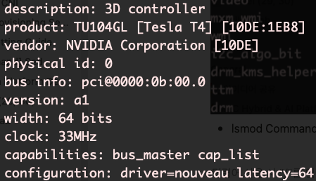

# NVIDIA GPU Node Setup

> NVIDIA GPU가 들어있는 Node에서 GPU 가속기를 사용하기 위해 설정할 작업 안내. 기본적으로 GPU가 있는 Worker Node에서 Base Setup을 진행
> 

# 1. NVIDIA Graphic Driver 설치

> NVIDIA GPU 사양을 사전에 확인 후 NVIDIA Driver 설치를 진행해야 함


```bash
# 물리적으로 어떤 GPU가 있나 확인
lspci | grep -i nvidia
```

- CentOS, Ubuntu 등에서는 간혹 OnBoard Graphic Driver가 설치되어 있는데, 이름은 *Nouveau* 로, NVIDIA Driver 설치를 위해서는 이를 **비활성화** 해야 함

```bash
# 추가로 Driver 확인하기 위한 lshw Package 설치 후 확인
sudo yum install lshw
lshw -numeric -C display
```



- lshw Command 후 나오는 화면 : Nouveau 드라이버 사용 중 확인

### Nouveau Disable 처리 : 방법이 다양해서 확실한 방법 탐색

- /etc/default/grub에 접근하여 **Nouveau ModeSet 0** 추가

```bash
sudo vi /etc/default/grub
```

```bash
GRUB_TIMEOUT=5
GRUB_DISTRIBUTOR="$(sed 's, release .*$,,g' /etc/system-release)"
GRUB_DEFAULT=saved
GRUB_DISABLE_SUBMENU=true
GRUB_TERMINAL_OUTPUT="console"
# 아래 라인에 rd.driver.blacklist=nouveau 추가
GRUB_CMDLINE_LINUX="crashkernel=auto rd.lvm.lv=centos/root rd.lvm.lv=centos/swap rhgb quiet rd.driver.blacklist=nouveau"
GRUB_DISABLE_RECOVERY="true"
```

```bash
# GRUB 설정 적용
sudo grub2-mkconfig -o /boot/grub2/grub.cfg
sudo grub2-mkconfig -o /boot/efi/EFI/centos/grub.cfg
```

- Blacklist에 Nouveau 추가

```bash
sudo vi /etc/modprobe.d/blacklist.conf
```

```bash
blacklist nouveau
options nouveau modeset=0
```

- **initramfs** (Initialization RAM File System)를 재생성

```bash
# initramfs 재생성
cd /boot
sudo mv initramfs-$(uname -r).img{,_backup}
sudo dracut

# Check : 해당 커맨드 입력 후 Output에 파일 목록이 있어야 함
ls initramfs-$(uname -r).img
```

- Reboot 후 Nouveau 활성화 여부 확인

```bash
sudo reboot

# 아무것도 나오지 말아야 함
lsmod | grep nouveau
```

## Package Installation

> NVIDIA GPU Driver 설치 과정에서 필요한 Package 설치
> 

```bash
# Compile에 필요한 Package Install
sudo yum -y install gcc gcc-c++ make binutils libtool autoconf automake patch pkgconfig redhat-rpm-config gettext

# Kernel의 Header, 개발용 Header 및 Script Package 설치
# 현재 OS Kernel Version과 동일해야하기 때문에 uname -r 을 사용해 진행
sudo yum -y install kernel-devel-$(uname -r) kernel-headers-$(uname -r) dkms
# EPEL : Extra Packages for Enterprise Linux
sudo yum -y install https://dl.fedoraproject.org/pub/epel/epel-release-latest-7.noarch.rpm
```

## Xorg Server Stop

- NVIDIA Driver 설치는 **Xorg Server(X윈도우)** 가 종료되어 있어야 설치가 가능

```bash
# Xorg Server 종료
sudo systemctl isolate multi-user.target
```

## NVIDIA Driver 설치

### NVIDIA Graphic Driver Download & Installation

위에서 확인했던 NVIDIA GPU 모델 확인 후 NVIDIA Graphic Driver 검색 진행

[[NVIDIA Graphic Driver 찾기 바로가기]](https://www.nvidia.com/Download/Find.aspx?lang=en-us)

다운로드 링크 주소 복사 후 Terminal 환경에서 wget으로 다운로드 진행

```bash
# NVIDIA Graphic Driver 다운로드 링크 복사해서 다운로드 진행 (wget이 없다면 설치 후 진행)
# NVIDIA Tesla T4 Driver (23.06.19 기준)
sudo wget https://us.download.nvidia.com/tesla/515.65.01/NVIDIA-Linux-x86_64-515.65.01.run
# NVIDIA Tesla K80 Driver (23.06.19 기준)
sudo wget https://us.download.nvidia.com/tesla/460.106.00/NVIDIA-Linux-x86_64-460.106.00.run

# 다운로드 후 확인
ls -la | grep NVIDIA-Linux-x86_64-515.65.01.run

# NVIDIA Graphic Driver 설치 진행 - 진행 중 나오는 화면은 모두 Yes
sudo sh ${NVIDIA_DRIVER}
```

### Installation Check

nvidia-smi 명령어를 통해 나오는 것 확인

```bash
nvidia-smi
```

---

# 2. NVIDIA Docker Installation

## NVIDIA Docker Installation

- CentOS 환경에서 NVIDIA Docker Install (Ubuntu는 조금 다름)
    - [[NVIDIA Official Install Guide 바로가기]](https://docs.nvidia.com/datacenter/cloud-native/container-toolkit/install-guide.html)
- CentOS

```bash
# Setup Package Repository & GPG Key
distribution=$(. /etc/os-release;echo $ID$VERSION_ID)
curl -s -L https://nvidia.github.io/nvidia-docker/$distribution/nvidia-docker.repo | \
sudo tee /etc/yum.repos.d/nvidia-docker.repo

# NVIDIA Container Install
sudo yum install -y nvidia-docker2
```

- Ubuntu

```bash
# Setup Package Repository & GPG Key
distribution=$(. /etc/os-release;echo $ID$VERSION_ID)
curl -fsSL https://nvidia.github.io/libnvidia-container/gpgkey | sudo gpg --dearmor -o /usr/share/keyrings/nvidia-container-toolkit-keyring.gpg | \
curl -s -L https://nvidia.github.io/libnvidia-container/$distribution/libnvidia-container.list
sed 's#deb https://#deb [signed-by=/usr/share/keyrings/nvidia-container-toolkit-keyring.gpg] https://#g'
sudo tee /etc/apt/sources.list.d/nvidia-container-toolkit.list

# NVIDIA Container Install
sudo apt-get update
sudo apt-get install -y nvidia-container-toolkit
sudo nvidia-ctk runtime configure --runtime=docker
```

- **Docker Damon JSON** 수정
    - 간혹 **CGroup Driver** 문제가 발생할 수 있는데, 이는 Kubernetes와 Docker 간의 CGroup Driver가 달라서 발생하는 문제로, Docker의 CGroup Driver는 **CGroupfs** 로 설정이 되어있고, Kubernetes는 **Systemd** 로 설정이 되는 경우가 있음. → Docker Daemon 설정에서 CGroup Driver를 **systemd** 로 변경해주어야 함
    - NVIDIA Docker를 설치한 후 Daemon Runtime을 변경 (/etc/docker/daemon.json)
    - Nexus(Private Docker Registry)를 사용하는 경우 **insecure-registries** 필드에 Nexus 주소도 함께 추가

```bash
# Docker Daemon JSON 수정
sudo vi /etc/docker/daemon.json
```

```json
{
    "exec-opts": ["native.cgroupdriver=systemd"],
    "default-runtime": "nvidia",
    "runtimes": {
        "nvidia": {
            "path": "/usr/bin/nvidia-container-runtime",
            "runtimeArgs": []
        }
    },
    "insecure-registries":["192.168.0.1:5000"]
}
```

```bash
# Docker Restart
sudo systemctl restart docker

# Docker, Kubelet Status Check
sudo systemctl status docker
sudo systemctl status kubelet
```

---

# 3. NVIDIA Device Plugin Installation

### Master Node환경에서 진행

Kubernetes 환경에서 NVIDIA GPU를 사용하기 위한 **NVIDIA Device Plugin** 설치 진행

https://github.com/NVIDIA/k8s-device-plugin

```bash
# NVIDIA Device Plugin 설치
kubectl create -f https://raw.githubusercontent.com/NVIDIA/k8s-device-plugin/v0.13.0/nvidia-device-plugin.yml

# 노드에 Taint가 설정되어 있다면 Device Plugin Pod가 배포되지 않을 수 있기 때문에 Daemonset에서 추가 설정 진행
kubectl edit daemonset -n kube-system nvidia-device-plugin-daemonset

# Device Plugin Pod 배포 확인
watch "kubectl get pod -n kube-system | grep nvidia-device-plugin"
```

## Node Taint/Toleration 작업

GPU Node에 Taint가 걸려있지 않다면, GPU를 사용하지 않는 Pod들도 배포되어 추후 GPU는 사용 가능한데, 다른 자원 부족으로 인해 Pod가 할당되지 않을 수도 있는 문제를 초래할 수도 있음.

```bash
# GPU Node Taint (kubectl taint node ${NODE_NAME} ${KEY}=${VALUE}:${OPTION}
kubectl taint node ${NODE_NAME} isGpu=True:NoSchedule
```

---

# 4. Test Pod 배포

GPU Node가 정상적으로 설정 되었는지 확인을 위한 간단한 Test Pod 배포 진행

```yaml
apiVersion: v1
kind: Pod
metadata:
  name: gpu-test-pod
  namespace: default
spec:
  restartPolicy: Never
  containers:
    - name: cuda-container
      image: nvcr.io/nvidia/k8s/cuda-sample:vectoradd-cuda10.2
      # 기본적으로 limits, requests에 NVIDIA GPU Resource 수를 정해줌
      resources:
        limits:
          nvidia.com/gpu: 1
      command: ["sleep", "infinity"]
  # GPU Node에 설정한 Taint 설정
  tolerations:
  - key: isGpu
    operator: Equal
    effect: NoSchedule
    value: "True"
```

- Pod 배포 후 Test

```bash
# Pod YAML 배포
kubectl apply -f gpu-test-pod.yaml

# GPU 할당 여부 확인 (Allocated resources에서 1로 늘어났는지 확인)
kubectl describe node ${NODE_NAME}

# Test Pod 접속 후 NVIDIA GPU 할당 확인
kubectl exec --stdin --tty -n default gpu-test-pod -- /binb/bash

# Pod 접속 후 NVIDIA GPU 확인
nvidia-smi
```

---

# [ERROR]

## 1. NVIDIA Driver 설치 과정에서 발생하는 문제

### 1. gcc Installation Check Error

- 에러 화면
    
    
    
- 해결 방법
- 

## Reference.

- [[Taint & Toleration 작업]](https://gruuuuu.github.io/cloud/k8s-taint-toleration/)
- [[NVIDIA Graphic Driver 설치 참조]](https://servermon.tistory.com/140)
