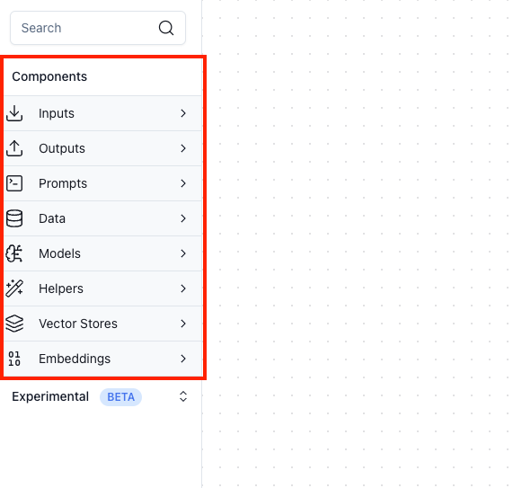
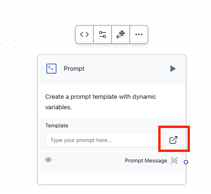
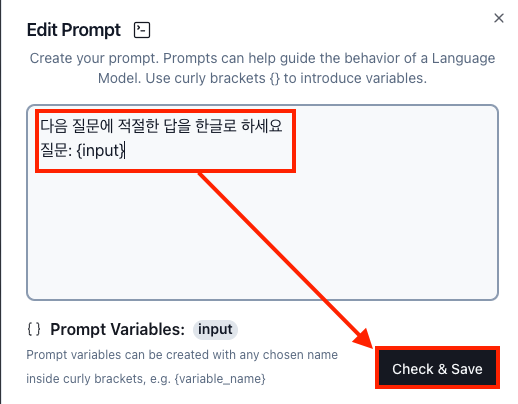
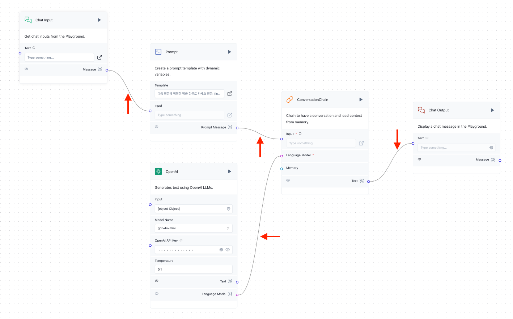

# LangFlow

> LLM, LangChain을 UI적으로 편하게 지원하는 Langflow에 대한 조사

## Installation

### Install by Docker → Kubernetes

> Helm Install이 아닌 Docker Image를 받아서 Kubernetes 환경에 구성한 방법

- Deployment.yaml
    
    Image는 F/E + B/E를 지원하는 **langflow**, F/E만 지원하는 **langflow-frontend**, B/E만 지원하는 **langflow-backend** 이렇게 나뉨
    
    ```yaml
    apiVersion: apps/v1
    kind: Deployment
    metadata:
      labels:
        app: langflow
      name: langflow
    spec:
      replicas: 1
      selector:
        matchLabels:
          app: langflow
      template:
        metadata:
          labels:
            app: langflow
        spec:
          containers:
          - image: langflowai/langflow:1.0.13
            env:
            # 새롭게 Database 구성
            - name: POSTGRES_USER
              value: postgres
            - name: POSTGRES_PASSWORD
              value: mypassword123!
            - name: POSTGRES_DB
              value: postgres
            name: langflow
            ports:
            - containerPort: 7860
    ```
    
    ```bash
    kubectl apply -f deployment.yaml -n ${NAMESPACE}
    ```
    

Deployment 배포 후 7860 Port LoadBalancer로 Port Forwarding

```bash
kubectl expose deploy -n ${NAMESPACE} --port=7860 --type=LoadBalancer
```

- Langflow 배포 후 Log
    
    ERROR 부분에 대해서는 원인 파악이 필요할 것으로 보임
    
    ```bash
    Starting Langflow v1.0.13...
    [07/30/24 06:43:59] ERROR    2024-07-30 06:43:59 - ERROR    - utils  utils.py:27
                                 - Error retrieving messages from                   
                                 monitor service: Catalog Error: Table              
                                 with name messages does not exist!                 
                                 Did you mean                                       
                                 "temp.information_schema.tables"?                  
                                 LINE 1: ...ession_id, text, files,                 
                                 timestamp FROM messages ORDER BY                   
                                 timestamp DESC                                     
                                                                                    
                                            ^                                       
                        ERROR    2024-07-30 06:43:59 - ERROR    -     service.py:221
                                 service - Error migrating                          
                                 transactions from monitor service to               
                                 database: Catalog Error: Table with                
                                 name transactions does not exist!                  
                                 Did you mean                                       
                                 "temp.information_schema.columns"?                 
                                 LINE 1: ...ex_id, inputs, outputs,                 
                                 target_id FROM transactions LIMIT                  
                                 100                                                
                                                                                    
                                               ^                                    
    ╭───────────────────────────────────────────────────────────────────╮
    │ Welcome to ⛓ Langflow                                             │
    │                                                                   │
    │                                                                   │
    │ Collaborate, and contribute at our GitHub Repo 🌟                 │
    │                                                                   │
    │ We collect anonymous usage data to improve Langflow.              │
    │ You can opt-out by setting DO_NOT_TRACK=true in your environment. │
    │                                                                   │
    │ Access http://0.0.0.0:7860                                        │
    ╰───────────────────────────────────────────────────────────────────╯
    ```
    

### Langflow Runtime 배포

> Langflow의 Backend만을 사용하는 Langflow Runtime 배포 방법 정리
> 
- 주의 사항
    1. Runtime 환경에서는 User 관련 환경 변수(super user, auto login …)들을 선언하게 되면 flow를 정상적으로 불러오지 못하는 케이스가 발생
    2. Path 형태로 Flow를 불러오기 위해서는 미리 해당 Flow가 볼륨 내부에 있어야 함
1. Helm 배포
    1. Helm Repo 가져오기
        
        ```bash
        # Helm Repo Add
        helm repo add langflow https://langflow-ai.github.io/langflow-helm-charts
        helm update langflow
        
        # Helm Langflow Runtime Pull
        helm pull langflow/langflow-runtime
        
        tar -xvzf langflow-runtime-0.1.0.tgz
        cd langflow-runtime
        ```
        
    2. values.yaml 수정
        - **downloadFlows** : Langflow Runtime에서 사용할 json 파일 형태의 flow를 가져올 경로로, 추후 Langflow Runtime Deployment의 **환경 변수(env)** 및 **인자(args)** 값들로 들어감
            - path : Pod 내 json 파일이 위치한 경로
            - flows > url : json 파일이 위치한 Web URL 경로
        - **env** : Langflow Runtime을 실행할 때 설정할 환경 변수 값
        - **volumes/volumeMounts** : 추가적인 PVC (json 파일이 있는 PVC를 Mount 할 때 사용)
        - values.yaml
            
            ```yaml
            replicaCount: 1
            
            image:
              repository: "langflowai/langflow-backend"
              pullPolicy: IfNotPresent
              tag: "1.0.13"
            
            downloadFlows:
              # json file이 위치한 디렉토리 경로
              path: /app/flows
            # flows:
            # - url: https://example.com/path/file.json
            # basicAuth: "user_id:password"
            # headers:
            # Authorization: "Bearer my_token"
            
            imagePullSecrets: []
            nameOverride: ""
            fullnameOverride: ""
            
            serviceAccount:
              # Specifies whether a service account should be created
              create: true
              # Automatically mount a ServiceAccount's API credentials?
              automount: true
              # Annotations to add to the service account
              annotations: {}
              # The name of the service account to use.
              # If not set and create is true, a name is generated using the fullname template
              name: ""
            
            podAnnotations: {}
            podLabels: {}
            
            podSecurityContext: {}
              # fsGroup: 2000
            
            securityContext: {}
              # capabilities:
              #   drop:
              #   - ALL
              # readOnlyRootFilesystem: true
              # runAsNonRoot: true
              # runAsUser: 1000
            env:
              - name: LANGFLOW_LOG_LEVEL
                value: "INFO"
              - name: DO_NOT_TRACK
                value: "true"
            #  - name: OPENAI_API_KEY
            #    valueFrom:
            #      secretKeyRef:
            #        name: langflow-secrets
            #        key: openai-key
            
            service:
              type: LoadBalancer
              port: 7860
            
            ingress:
              enabled: false
              className: ""
              annotations: {}
                # kubernetes.io/ingress.class: nginx
                # kubernetes.io/tls-acme: "true"
              hosts:
                - host: chart-example.local
                  paths:
                    - path: /
                      pathType: ImplementationSpecific
              tls: []
              #  - secretName: chart-example-tls
              #    hosts:
              #      - chart-example.local
            
            resources: {}
              # We usually recommend not to specify default resources and to leave this as a conscious
              # choice for the user. This also increases chances charts run on environments with little
              # resources, such as Minikube. If you do want to specify resources, uncomment the following
              # lines, adjust them as necessary, and remove the curly braces after 'resources:'.
              # limits:
              #   cpu: 100m
              #   memory: 128Mi
              # requests:
              #   cpu: 100m
              #   memory: 128Mi
            
            livenessProbe:
              httpGet:
                path: /api/v1/version
                port: http
            readinessProbe:
              httpGet:
                path: /api/v1/version
                port: http
            
            volumes: 
              - name: langflow-runtime-flow-pvc
                persistentVolumeClaim:
                  claimName: langflow-runtime-flow-pvc
            # - name: foo
            #   secret:
            #     secretName: mysecret
            #     optional: false
            
            # Additional volumeMounts on the output Deployment definition.
            volumeMounts:
              - name: langflow-runtime-flow-pvc
                mountPath: "/app/flows"
            # - name: foo
            #   mountPath: "/etc/foo"
            #   readOnly: true
            
            nodeSelector: {}
            
            tolerations: []
            
            affinity: {}
            ```
            
    3. helm install
        
        ```bash
        helm install langflow-runtime langflow/langflow-runtime \
        -f ${VALUES_YAML_FILE} \
        -n ${NAMESPACE}
        ```
        
2. Deployment 배포 및 서비스 Expose
    - deployment.yaml
        
        helm 배포에서 **downloadFlows** 에 설정한 부분에서 URL을 통한 download를 하게 되면 args에 json 타입의 flow를 다운받는 부분이 args에 추가로 들어가며, **LANGFLOW_LOAD_FLOWS_PATH** 는 flow가 위치한 경로를 담고 있는 환경 변수가 된다.
        
        ```yaml
        apiVersion: apps/v1
        kind: Deployment
        metadata:
          labels:
            app: langflow-runtime
          name: langflow-runtime
        spec:
          replicas: 1
          selector:
            matchLabels:
              app: langflow-runtime
          template:
            metadata:
              labels:
                app: langflow-runtime
            spec:
              containers:
              - image: langflowai/langflow-backend:1.0.13
                args:
                - |
                  set -e && langflow run --backend-only --host 0.0.0.0 --port 7860
                command:
                - /bin/bash
                - -c
                env:
                - name: LANGFLOW_LOAD_FLOWS_PATH
                  value: /app/flows
                - name: LANGFLOW_LOG_LEVEL
                  value: INFO
                - name: DO_NOT_TRACK
                  value: "true"
                name: langflow-runtime
                volumeMounts:
                - mountPath: /app/flows
                  name: langflow-runtime-flow-pvc
                ports:
                - containerPort: 7860
                  name: http
                  protocol: TCP
                livenessProbe:
                  httpGet:
                    path: /api/v1/version
                    port: http
                readinessProbe:
                  httpGet:
                    path: /api/v1/version
                    port: http
                resources:
                  requests:
                    cpu: 2
                    memory: 4Gi
              # Langflow의 Flow json 파일이 들어있는 PVC Mount
              volumes:
              - name: langflow-runtime-flow-pvc
                persistentVolumeClaim:
                  claimName: langflow-runtime-flow-pvc
        ```
        
    
    ```bash
    # Deployment 배포
    kubectl apply -f deployment.yaml -n ${NAMESPACE}
    
    # Service 노출
    kubectl expose -f deployment.yaml -n ${NAMESPACE} \
    --type=LoadBalancer \
    --port=7860
    ```
    

## Sample from LangFlow UI

> Langflow UI에서 구성 및 테스트 안내
> 

### 1. 컴포넌트 배치

Flow를 구성하d는데 필요한 **컴포넌트(Prompt, LLM Model, Input, Ouput …)** 배치



### 2. Prompt 정의

Input, Output에 대한 가이드를 정의하는 Prompt 설정





### 3. 외부 LLM의 API Key 입력

OpenAI 기준 OpenAI API Key 를 입력 (그래야 OpenAI의 모델 사용이 가능)


### 4. 컴포넌트간 연결

Flow를 만들기 위해 컴포넌트(노드)간 연결(Edge)



### 5. Build 및 Playground를 통한 테스트

각 컴포넌트 단위로 **[>]** 버튼을 통해 빌드를 수행할 수 있고 특정 컴포넌트 이전에 Edge로 연결된 컴포넌트가 있따면 이전 컴포넌트들부터 **순차적으로 해당 컴포넌트까지 빌드를 수행**


빌드가 정상적으로 끝나면 **Playground** 에서 Chat Input을 넣고 Flow 기반으로 나온 Output Chat 내용을 확인 가능


## API

> API 호출을 통한 사용법


API는 Flow를 LangFlow 외부에서 사용할 때 호출하는데, **LangFlow Runtime (Backend-Only)** 환경에서도 API를 호출하여 Flow를 사용한다.

- API의 Endpoint
    
    ```
    /api/v1/run/{flow_id}
    ```
    
- Header
    - **x-api-key (optional)**
        
        해당 API를 사용하기 위한 **LangFlow의 API Key** 로, LangFlow 데이터(사용자, Flow 등등…)가 Database를 통해 관리되고, 사용자가 존재한다면, API를 사용하기 위한 Key를 발급 받고 이를 **Header** 의 **x-api-key** 필드에 설정하고 호출해야 함
        
        LangFlow Runtime 환경에서는 사용하지 않아도 되는 Header 값
        
        - API Key 생성 방법
            1. LangFlow Login
                - Endpoint : **[POST] /api/v1/login**
                - Header
                    
                    ```text
                    Content-Type: application/x-www-form-urlencoded
                    ```
                    
                - Request Body
                    
                    ```
                    grant_type=password&username=user&password=password123!&scope=&client_id=string&client_secret=string
                    ```
                    
                - Response Body
                    
                    **access_token** 값을 추후에 사용
                    
                    ```json
                    {
                        "access_token": "<ACCESS_TOKEN_VALUE>",
                        "refresh_token": "<REFRESH_TOKEN_VALUE>",
                        "token_type": "bearer"
                    }
                    ```
                    
            2. Create API Key
                - Endpoint : **[POST] /api/v1/api_key**
                - Header
                    
                    Login API 호출해서 나온 **access token** 을 **Authorization** 의 **Bearer Token** 값으로 설정
                    
                    ```
                    Authorization: Bearer <ACCESS_TOKEN_VALUE>
                    ```
                    
                - Request Body
                    
                    ```json
                    {
                      "name": "test-api-key",
                      "is_active": true
                    }
                    ```
                    
                - Response Body
                    
                    **api_key** 필드의 값이 추후 Header의 **x-api-key** 값으로 사용
                    
                    ```json
                    {
                        "name": "test-api-key",
                        "last_used_at": null,
                        "total_uses": 0,
                        "is_active": true,
                        "id": "<ID>",
                        "api_key": "<API_KEY_VALUE>",
                        "user_id": "<USER_ID>"
                    }
                    ```
                    
- Request Body
    - **Non-Tweaks** (Base)
        
        ```json
        {
            "input_type": "chat",
            "output_type": "chat",
            "input_value": "LangFlow에 대해 간단하게 알려줘"
        }
        ```
        
    - **Tweaks** : 각 컴포넌트들의 Input/Output 및 세부 설정 값들이 포함된 Request Body
        
        ```json
        {
          "input_value": "message",
          "output_type": "chat",
          "input_type": "chat",
          "tweaks": {
            "OpenAIModel-FAGyY": {
              "api_key": "<OPENAI_API_KEY>",
              "input_value": "",
              "json_mode": false,
              "max_tokens": null,
              "model_kwargs": {},
              "model_name": "gpt-4o-mini",
              "openai_api_base": "",
              "output_schema": {},
              "seed": 1,
              "stream": true,
              "system_message": "",
              "temperature": 0.1
            },
            "ConversationChain-lfg3X": {
              "input_value": ""
            },
            "Prompt-klcWu": {
              "template": "다음 질문에 적절한 답을 한글로 하세요\n질문: {input}",
              "input": ""
            },
            "ChatInput-9sCeo": {
              "files": "",
              "input_value": "안녕?",
              "sender": "User",
              "sender_name": "User",
              "session_id": "",
              "should_store_message": true
            },
            "ChatOutput-bAZM7": {
              "data_template": "{text}",
              "input_value": "",
              "sender": "Machine",
              "sender_name": "AI",
              "session_id": "",
              "should_store_message": true
            }
          }
        }
        ```
        
- Response Body
  
  ```json
    {
    "session_id": "<SESSION_ID>",
    "outputs": [
        {
            "inputs": {
                "input_value": "풋살에 대해서 간단하게 알려줘"
            },
            "outputs": [
                {
                    "results": {
                        "message": {
                            "text_key": "text",
                            "data": {
                                "text": "풋살은 실내에서 또는 야외의 작은 필드에서 진행되는 소규모 축구의 일종입니다. 일반적으로 5명의 선수로 구성된 두 팀이 경기를 하며, 경기는 20분씩 두 개의 하프타임으로 나뉘어 진행됩니다. 풋살은 공이 바닥에서 굴러가는 방식으로 진행되며, 공의 크기는 일반 축구공보다 작고 무게도 가벼워서 더 빠르고 기술적인 플레이를 요구합니다.\n\n풋살의 규칙은 일반 축구와 비슷하지만, 오프사이드 규칙이 없고, 파울이 누적되면 프리킥이 주어지는 방식으로 진행됩니다. 이 스포츠는 기술, 빠른 반응, 팀워크를 강조하며, 많은 나라에서 인기 있는 스포츠로 자리 잡고 있습니다. 특히 브라질과 스페인 같은 나라에서는 풋살이 축구 선수들의 기초 기술을 연마하는 데 중요한 역할을 하고 있습니다.",
                                "sender": "Machine",
                                "sender_name": "AI",
                                "session_id": "<SESSION_ID>",
                                "files": [],
                                "timestamp": "2024-08-02 04:56:55",
                                "flow_id": "<FLOW_ID>"
                            },
                            "default_value": "",
                            "text": "풋살은 실내에서 또는 야외의 작은 필드에서 진행되는 소규모 축구의 일종입니다. 일반적으로 5명의 선수로 구성된 두 팀이 경기를 하며, 경기는 20분씩 두 개의 하프타임으로 나뉘어 진행됩니다. 풋살은 공이 바닥에서 굴러가는 방식으로 진행되며, 공의 크기는 일반 축구공보다 작고 무게도 가벼워서 더 빠르고 기술적인 플레이를 요구합니다.\n\n풋살의 규칙은 일반 축구와 비슷하지만, 오프사이드 규칙이 없고, 파울이 누적되면 프리킥이 주어지는 방식으로 진행됩니다. 이 스포츠는 기술, 빠른 반응, 팀워크를 강조하며, 많은 나라에서 인기 있는 스포츠로 자리 잡고 있습니다. 특히 브라질과 스페인 같은 나라에서는 풋살이 축구 선수들의 기초 기술을 연마하는 데 중요한 역할을 하고 있습니다.",
                            "sender": "Machine",
                            "sender_name": "AI",
                            "files": [],
                            "session_id": "<SESSION_ID>",
                            "timestamp": "2024-08-02 04:56:55",
                            "flow_id": "<FLOW_ID>"
                        }
                    },
                    "artifacts": {
                        "message": "풋살은 실내에서 또는 야외의 작은 필드에서 진행되는 소규모 축구의 일종입니다. 일반적으로 5명의 선수로 구성된 두 팀이 경기를 하며, 경기는 20분씩 두 개의 하프타임으로 나뉘어 진행됩니다. 풋살은 공이 바닥에서 굴러가는 방식으로 진행되며, 공의 크기는 일반 축구공보다 작고 무게도 가벼워서 더 빠르고 기술적인 플레이를 요구합니다.\n\n풋살의 규칙은 일반 축구와 비슷하지만, 오프사이드 규칙이 없고, 파울이 누적되면 프리킥이 주어지는 방식으로 진행됩니다. 이 스포츠는 기술, 빠른 반응, 팀워크를 강조하며, 많은 나라에서 인기 있는 스포츠로 자리 잡고 있습니다. 특히 브라질과 스페인 같은 나라에서는 풋살이 축구 선수들의 기초 기술을 연마하는 데 중요한 역할을 하고 있습니다.",
                        "sender": "Machine",
                        "sender_name": "AI",
                        "files": [],
                        "type": "object"
                    },
                    "outputs": {
                        "message": {
                            "message": {
                                "text": "풋살은 실내에서 또는 야외의 작은 필드에서 진행되는 소규모 축구의 일종입니다. 일반적으로 5명의 선수로 구성된 두 팀이 경기를 하며, 경기는 20분씩 두 개의 하프타임으로 나뉘어 진행됩니다. 풋살은 공이 바닥에서 굴러가는 방식으로 진행되며, 공의 크기는 일반 축구공보다 작고 무게도 가벼워서 더 빠르고 기술적인 플레이를 요구합니다.\n\n풋살의 규칙은 일반 축구와 비슷하지만, 오프사이드 규칙이 없고, 파울이 누적되면 프리킥이 주어지는 방식으로 진행됩니다. 이 스포츠는 기술, 빠른 반응, 팀워크를 강조하며, 많은 나라에서 인기 있는 스포츠로 자리 잡고 있습니다. 특히 브라질과 스페인 같은 나라에서는 풋살이 축구 선수들의 기초 기술을 연마하는 데 중요한 역할을 하고 있습니다.",
                                "sender": "Machine",
                                "sender_name": "AI",
                                "session_id": "<SESSION_ID>",
                                "files": [],
                                "timestamp": "2024-08-02 04:56:55",
                                "flow_id": "<FLOW_ID>"
                            },
                            "type": "object"
                        }
                    },
                    "logs": {
                        "message": []
                    },
                    "messages": [
                        {
                            "message": "풋살은 실내에서 또는 야외의 작은 필드에서 진행되는 소규모 축구의 일종입니다. 일반적으로 5명의 선수로 구성된 두 팀이 경기를 하며, 경기는 20분씩 두 개의 하프타임으로 나뉘어 진행됩니다. 풋살은 공이 바닥에서 굴러가는 방식으로 진행되며, 공의 크기는 일반 축구공보다 작고 무게도 가벼워서 더 빠르고 기술적인 플레이를 요구합니다.\n\n풋살의 규칙은 일반 축구와 비슷하지만, 오프사이드 규칙이 없고, 파울이 누적되면 프리킥이 주어지는 방식으로 진행됩니다. 이 스포츠는 기술, 빠른 반응, 팀워크를 강조하며, 많은 나라에서 인기 있는 스포츠로 자리 잡고 있습니다. 특히 브라질과 스페인 같은 나라에서는 풋살이 축구 선수들의 기초 기술을 연마하는 데 중요한 역할을 하고 있습니다.",
                            "sender": "Machine",
                            "sender_name": "AI",
                            "session_id": "<SESSION_ID>",
                            "component_id": "ChatOutput-bAZM7",
                            "files": [],
                            "type": "message"
                        }
                    ],
                    "component_display_name": "Chat Output",
                    "component_id": "ChatOutput-bAZM7",
                    "used_frozen_result": false
                }
            ]
        }
    ]
}
  ```
